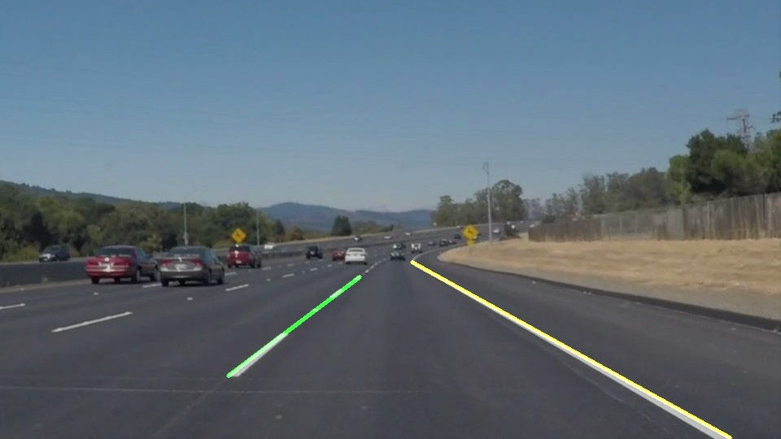

# **Finding Lane Lines on the Road** 

Overview
---

The goal of the project is to implement pipeline for line marking detection which uses Hough transformation.
As an input the pipeline shall take road images and as an output return an annotated image.

Repository description
---
* #### examples
  Contains examples copied from original repository

* #### test_images
  Images on which pipeline parametes were tuned

* #### test_images_output
  Labelled images from test_images folder

* #### test_videos
  Videos on which pipeline was tested

* #### test_videos_output
  Labelled videos from test_videos folder

* #### P1.ipynb
  Modified jupyter notebook from original repository.
  Contains pipeline source code.

* #### WriteUp.html
  Write up of the project in jupyter notebook form exported to html.
  Contains pipeline description and reflection.
  

